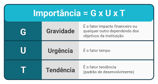
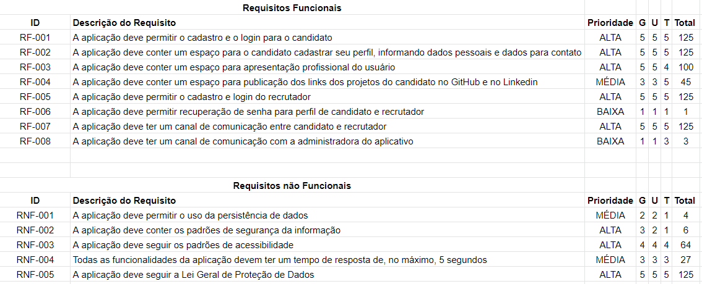
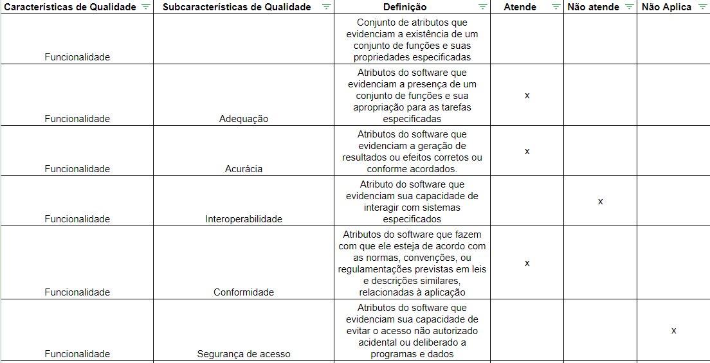
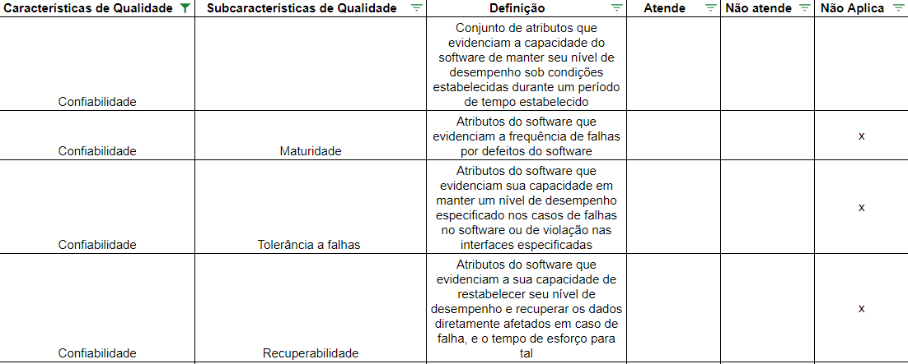

# Especificações do Projeto

## Personas

Fernanda Silva tem 23 anos e é formada em Ciências da Computação. Ela busca um site personalizado onde possa publicar seus projetos feitos em treinamentos na universidade e os trabalhos realizados nas empresas onde trabalhou, com links de acesso ao GitHub e ao Linkedin, para que possa apresentar aos recrutadores, facilitando seu ingresso no mercado de trabalho, mesmo sem uma área específica.

 

André Maia tem 35 anos, é portador de deficiência física, desenvolvedor pleno back-end em Python e está em busca de novos desafios em linguagem ABAP. Ele possui vários projetos que demonstram sua experiência profissional e conhecimento em lógica de programação e gostaria de publicá-los em alguma plataforma. André gostaria de ter a oportunidade de participar de cursos de aperfeiçoamento em sua nova área. Ele pretende se disponibilizar para vagas de estágio de desenvolvedor ABAP. Espera também que esta ferramenta possibilite sua disponibilização frente às oportunidades do mercado de trabalho na área de TI. 

Maria José tem 29 anos, é uma Tech Recruiter de uma multinacional de transformação digital à procura de um profissional específico, deseja encontrar com urgência um desenvolvedor ABAP sênior que tenha profundo conhecimento no módulo FI e tenha disponibilidade para viagens, visto que a empresa opera em vários projetos com prazos curtos e precisa reforçar o time de desenvolvimento o quanto antes. Maria José teve dificuldade de encontrar esse profissional nas ferramentas convencionais e gostaria de uma aplicação que tenha diversos filtros para facilitar sua busca e encontrar exatamente o que procura no menor tempo possível.

João da Silva tem 46 anos e é Gerente de Projetos de TI em um grande banco. Foi recentemente incumbido de montar uma nova equipe para o desenvolvimento de uma nova plataforma de investimentos (web e móvel), que deverá operar de forma independente do aplicativo de Internet Banking. Na primeira fase será desenvolvida apenas a aplicação web, e para esta equipe João precisa buscar profissionais especialistas em ASP.NET e SQL Server, além de um especialista em UX. Como não encontra profissionais com estas especialidades, está considerando contratar profissionais de outras linguagens e custear o treinamento e a capacitação - uma alternativa que terá um grande impacto no cronograma do projeto.

Fernanda Silva tem 23 anos e é formada em Ciências da Computação. Ela busca um site personalizado onde possa publicar seus projetos feitos em treinamentos na universidade e os trabalhos realizados nas empresas onde trabalhou, com links de acesso ao GitHub e ao Linkedin, para que possa apresentar aos recrutadores, facilitando seu ingresso no mercado de trabalho, mesmo sem uma área específica. 

 

Antonio Bandeira tem 54 anos, é Gerente do setor de Tecnologia da Informação de uma grande multinacional, está a procura de bons desenvolvedores. Está entrevistando a Maria José e deseja acessar o site para visualizar seus projetos, acessar seu Linkedin e seu perfil do GitHub e de outros usuarios. 

Marina Rodrigues tem 35 anos, é uma desenvolvedora Jr front-end em React Js buscando oportunidade como desenvolvedora back-end C#. Marina possui um portfólio inicial em React e gostaria de divulgá-lo com intenção de receber uma oferta de emprego para atuar na área. Inclusive pensando em carreira internacional. Além disso, ela deseja se conectar com outros desenvolvedores na linguagem C# para compartilhar e adquirir conhecimento sobre a linguagem. 

## Histórias de Usuários

Com base na análise das personas forma identificadas as seguintes histórias de usuários:

|EU COMO... `PERSONA`| QUERO/PRECISO ... `FUNCIONALIDADE`                              |PARA ... `MOTIVO/VALOR`                                               |
|--------------------|-----------------------------------------------------------------|----------------------------------------------------------------------|
|Fernanda Silva      | Publicar meus projetos                                          | ingressar rapidamente no mercado de trabalho sem área específica  |
|Fernanda Silva       | Organizar meus projetos em ordem cronológica                   | para mostrar minha evolução e facilitar o entendimento dos recrutadores |
|Fernanda Silva       | Oferecer acesso ao Git Hub e ao LinkedIn                       | para mostrar os projetos realizados na universidade e nas empresas que trabalhei |
|Fernanda Silva       | Publicar meus projetos                                         | para facilitar o acesso do Recrutar aos trabalhos realizados |
|André Maia          | Publicar meus projetos que comprovem minha experiência e conhecimentos em lógica de programação | conseguir um contato com empresas que contratam e promovam treinamentos em ABAP para pessoas experientes em outras linguagens |
|André Maia          | Trocar conhecimentos com profissionais SAP ABAP | compartilhar conhecimentos rapidamente com qualquer pessoa |
|Maria José          | Organizar meus projetos por linguagens                          | mostrar minhas habilidades para recrutadores                            |
|João da Silva       | Encontrar profissionais com conhecimentos específicos           | reduzir o tempo necessário de treinamento e capacitação                            |
|João da Silva       | Ter uma plataforma onde consiga pesquisar profissionais utilizando filtros, como a experiência com uma linguagem | encontrar o profissional ideal para cada posição da sua equipe|
|João da Silva       | Ter uma plataforma onde consiga pesquisar profissionais por área de atuação - como frontend, backend, banco de dados, UX |encontrar o profissional ideal para cada posição da sua equipe|
|João da Silva       | Pesquisar os profissionais combinando diferentes tipos de filtro | encontrar o melhor profissional possível que esteja disponível para integrar sua equipe|
|João da Silva       | Pesquisar profissionais que já trabalharam no setor financeiro | ter na equipe uma pessoa mais familiarizada com as regras de negócio do projeto|
|João da Silva       | Ter a possibilidade de entrar em contato com os profissionais | agendar uma entrevista|
|Ana Maria           | Organizar seus projetos em ordem cronológica                    | para mostrar minha evolução e facilitar o entendimento dos recrutadores |
| Ana Maria            | Publicar meus projetos em Java                                   | ingressar de maneira rápida no mercado de trabalho                      |
| Ana Maria            | Trocar experiências com outros desenvolvedores em Java           | adquirir e compartilhar conhecimentos sobre a linguagem                 |
|Antonio Bandeira    | Visualizar projetos                                             | Recrutar a Maria José e outros desenvolvedores.                         |
| Administrador        | Alterar permissões                                               | Permitir que possam administrar contas                                  |
| Marina Rodrigues      | Fornecer em uma unica aplicação acesso ao meu perfil do GitHub   | Facilitar o trabalho do recrutador                                         |

## Modelagem do Processo de Negócio 

### Situação Atual

Passos
1)	O Gestor de TI solicita a contratação para uma vaga, informando o perfil necessário
2)	O recrutador realiza a divulga a vaga
3)	O recrutador recebe currículos dos candidatos
4)	O recrutador faz uma triagem nos currículos, descartando aqueles que não se alinham ao perfil
5)	O recrutador faz uma segunda triagem nos currículos, selecionando 1 candidato para entrevistar
6)	O recrutador entra em contato com o candidato agendando uma entrevista
7)	O recrutador realiza a entrevista
8)	Se o candidato está alinhado com o perfil solicitado, o recrutador agenda uma nova entrevista, a ser realizada pelo Gestor. Caso contrário, seleciona outro candidato (volta ao passo 5)
9)	O Gestor realiza a entrevista
10)	Se o candidato é aprovado, o Gestor o encaminha para a realização de um teste prático. Caso contrário, o Gestor solicita outro candidato ao Recrutador (volta ao passo 5).
11)	O Candidato realiza o teste prático
12)	Se o candidato é aprovado, o processo é finalizado e enviado ao RH para contratação. Caso contrário, o Gestor solicita outro candidato ao Recrutador (volta ao passo 5)
13)	Se nenhum candidato é aprovado e não restam mais currículos, o recrutador inicia a busca por profissional já empregado.
14)	O recrutador faz uma busca no LinkedIn considerando alguns parâmetros.
15)	O recrutador escolhe um profissional para abordar, informando sobre a oportunidade aberta.
16)	Se o profissional aceita participar do processo seletivo, continua no passo 7.
17)	Se não aceita ou o candidato não é aprovado, volta ao passo 15.

### Análise
O processo é inteiramente manual. O recrutador deve analisar os currículos recebidos um a um para realizar a primeira triagem. O recrutador pode agendar entrevistas com vários candidatos, mas, se nenhum for aprovado, deve-se fazer nova triagem e novas entrevistas. Como não existe uma padronização de currículos no mercado, frequentemente as informações estão incompletas e o recrutador deve entrar em contato com o candidato a fim completá-las. Além disso, quando há a necessidade de um perfil muito específico, cresce a necessidade de entrevistas prévias com os candidatos.
A situação atual do mercado de TI – com a demanda crescendo mais rapidamente que a formação de profissionais – impacta na quantidade de candidatos em um processo seletivo. Assim, é comum que vagas demorem meses para serem preenchidas. Quando há urgência na contratação, o recrutador precisa buscar por profissionais atuando em outras empresas, uma atividade que demanda mais tempo que o processo seletivo padrão.
Por fim, não raro contratam quem está disponível ou quem aceita a oferta – e custeiam-se longas fases de capacitação e adaptação. Profissional e empresa acabam não ficando satisfeitos um com o outro – já que o profissional atuando fora da sua especialidade tende a produzir menos.

#### Sob a ótica do candidato
O estudante ou profissional em busca de colocação no mercado deve ficar atendo a diversas plataformas onde as oportunidades são divulgadas. Envia o currículo para a vaga de interesse e aguarda o recrutador entrar em contato. É comum que as vagas anunciadas contenham poucas informações, então o candidato envia seu currículo na esperança de ter mais informações durante a entrevista. Em alguns casos o candidato aceitará oportunidades por ter salários mais altos, mesmo que fora da sua área preferencial de atuação.

## Possibilidades de melhoria
Profissionais de TI de todos os níveis podem cadastrar seu perfil em uma plataforma. Como muitos campos seriam fechados (botões de rádio, listas), grande parte das informações ficaria padronizada. Como existem campos específicos, o profissional provê maiores informações sobre seus conhecimentos e habilidades.
Profissionais de recrutamento com acesso à plataforma podem usar ferramentas de busca e filtro para encontrar candidatos ideais para sua necessidade.

## Processo 1 - Recrutamento de Profissional de TI (passivo)

O arquivo original (formato bpmn) pode ser visto em na pasta docs/files: [Processo_Negocio_BPMN_Atual_Passivo.bpmn](files/Processo_Negocio_BPMN_Atual_Passivo.bpmn)

## Processo 2 - Recrutamento de Profissional de TI (ativo)

O arquivo original (formato bpmn) pode ser visto em na pasta docs/files: [Processo_Negocio_BPMN_Atual_ativo.bpmn](files/Processo_Negocio_BPMN_Atual_ativo.bpmn)

### Descrição Geral da Proposta

1.	O profissional de Ti cadastra seu perfil, informando dados pessoais, dados para contato e:
    - Área de atuação: Front-end, back-end, Full Stack, Banco de Dados, UX, etc;
    - Conhecimento em linguagens: seleção da linguagem e atribuindo uma nota ou conceito
    - Experiências profissionais anteriores (relacionadas a TI ou não)
    - Projetos: projetos de seu repositório Github que gostaria de destacar, com imagem, descrição e outras informações
    - Escolaridade 
    - Outros cursos
    - Certificações
    - Soft skills
    - Outras habilidades
    - Outras informações
    - Disponibilidade para viagem, mudança de cidade/estado/país
    - Modalidade de trabalho: remota, presencial, híbrida
    - Se está aberto a novas oportunidades de carreira (se não o perfil não aparecerá nos resultados de busca dos recrutadores
2.	O recrutador acessa a plataforma e especifica o perfil da vaga.
3.	A plataforma retorna os perfis que atendem aos critérios
4.	O recrutador envia mensagens aos candidatos agendando entrevista
5.	O processo de seleção segue o fluxo atual

### Possibilidades futuras:
* Oferta de cursos de curta e média duração para os profissionais
* Possibilidade da empresa enviar os testes para os candidatos realizarem através da plataforma, * tornando o processo mais célere
* Possibilidade de criação de testes próprios da plataforma – evita a necessidade de a empresa realizar testes durante o processo seletivo

## Indicadores de Desempenho

Os indicadores de desempenho (KPI) são métricas de avaliação do fluxo de trabalho que mostram os níveis de capacidade, qualidade, produtividade das operação e trabalhadores em relação aos objetivos e metas traçados no planejamento estratégico.  
Para que esses indicadores de desempenho possam contribuir significativamente no controle da empresa, é preciso ter um entendimento do planejamento estratégico e ter objetivos claros na hora de definir as metas. O resultado, então, servirá como referência para o processo de tomada de decisão e para a criação de estratégias de melhorias.
Devemos ter sempre em mente que a métrica de desempenho deve apoiar a gestão, e não atrapalhá-la.  
Para que possamos medir o desempenho do projeto, usaremos os seguintes indicadores:

|    #    |    **Indicador**    |     **Objetivos**   |    **Descrição**    |     **Cálculo**     |      **Fonte**      |    **Perspectiva**  |
|---------|---------------------|---------------------|---------------------|---------------------|---------------------|---------------------|
|    1    | Quantidade de cadastros de profissionais de TI |   Acompanhar o crescimento do aplicativo    |   Avaliar a quantidade de cadastros de profissionais de TI efetivados   |   nº de cadastros de profissionais de TI/período   |   Playstore   |   Crescimento e relevância   |
|    2    | Quantidade cadastros de recrutadores | Avaliar se os recrutadores também estão usando a ferramenta |   Avaliar a quantidade de cadastros de recrutadores   |   nº de cadastros de recrutadores efetivados/período   |   Playstore   |   Crescimento e relevância   |
|    3    | Quantidade de mensagens enviadas | Avaliar o fluxo de troca de mensagens   |   Avaliar a quantidade de mensagens enviadas   |   nº de contratações concretizadas/semana   |   Playstore   |   Registro de interações   |
|    4    | Quantidade de contratações concretizadas por semana |   Avaliar a efetividade do app   |   Avaliar a quantidade de contratações concretizadas por semana   |   nº de cadastros de profissionais de TI/período   |   Playstore   |   Efetividade ao que se propõe   |
|    5    | Percentual médio de preenchimento do perfil |      |   Avaliar o percentual médio de preenchimento do perfil   |   percentual médio de preenchimento de perfil/período  |   Playstore   |   Efetividade   |
|    6    | Quantidade de downloads por mês |   Acompanhar o crescimento do aplicativo   |   Avaliar a taxa de downloads realizados na loja   |   nº de downloands/período   |   Playstore   |   Crescimento e Aprendizado   |
|    7    | Quantidade de desinstalações por mês |   Entender os motivos das desinstalações   |   Avaliar a quantidade de desinstalações por mês   |   nº de desinstalações/mês   |   Playstore   |   Processos internos   |
|    8    | Quantidade de usuários cadastrados de fato por mês |   Avaliar o sucesso do aplicativo   |   Avaliar a quantidade de usuários cadastrados de fato por mês   |   nº de usuários cadastrados de fato/mês   |   Playstore   |   Crescimento   |
|    9    | Medir o tempo de utilização do app e quantas vezes ele é aberto por dia |   Avaliar a importância do app   |   Avaliar o tempo de utilização do app e quantas vezes ele é aberto por dia   |   tempo de utilização do app/dia  e  nº de vezes que o app é aberto/dia  |   Playstore   |   Processos Internos   |

## Requisitos

### Requisitos Funcionais

Os requisitos funcionais são de extrema importância no desenvolvimento de aplicativos, pois, sem eles não há funcionalidades nos sistemas. Seus modelos devem ser construídos em um nível de entendimento claro e objetivo, além de um código fonte totalmente aplicável. 

|ID    | Descrição do Requisito                                                                                  | Prioridade |
|------|---------------------------------------------------------------------------------------------------------|------------|
|RF-001| A aplicação deve permitir o cadastro e o login para o candidato                                         |    ALTA  | 
|RF-002| A aplicação deve conter um espaço para o candidato cadastrar seu perfil, informando dados pessoais e dados para contato|    ALTA   | 
|RF-003| A aplicação deve conter um espaço para apresentação profissional do usuário                                   |    ALTA    | 
|RF-004| A aplicação deve conter um espaço para publicação dos links dos projetos do candidato no GitHub e no Linkedin |    MÉDIA   |
|RF-005| A aplicação deve permitir o cadastro e login do recrutador                                                    |    ALTA   |
|RF-006| A aplicação deve permitir recuperação de senha para perfil de candidato e recrutador                          |    ALTA   |
|RF-007| A aplicação deve ter um canal de comunicação entre candidato e recrutador                                     |    ALTA  |
|RF-008| A aplicação deve ter um canal de comunicação com a administradora do aplicativo                               |    MÉDIA  |
|RF-009|                                                                                                               |       |
|RF-010|                                                                                                               |       |

### Requisitos não Funcionais

|ID     | Descrição do Requisito                                                                                                      |Prioridade |
|-------|-----------------------------------------------------------------------------------------------------------------------------|-----------|
|RNF-001| A aplicação deve permitir o uso da persistência de dados                                                                    |   MÉDIA   | 
|RNF-002| A aplicação deve conter os padrões de segurança da informação                                                               |   ALTA    | 
|RNF-003| A aplicação deve seguir os padrões de acessibilidade                                                                        |   ALTA    | 
|RNF-004| Todas as funcionalidades da aplicação devem ter um tempo de resposta de, no máximo, 5 segundos                              |   MÉDIA   | 
|RNF-005| A aplicação deve seguir a Lei Geral de Proteção de Dados                                                                    |   ALTA   | 
|RNF-006|                                                                                                                             |      | 
|RNF-007|                                                                                                                             |      | 
|RNF-008|                                                                                                                             |      | 

## Restrições

O projeto está restrito pelos itens apresentados na tabela a seguir.

|ID| Restrição                                                      |
|--|----------------------------------------------------------------|
|01| O projeto deverá ser entregue até o final do semestre          |
|02| Não pode ser desenvolvido apenas um módulo de Front-End        |
|03| O projeto será somente WEB                                     |

## Diagrama de Casos de Uso

# Matriz de Rastreabilidade

A matriz de rastreabilidade é uma ferramenta usada para facilitar a visualização dos relacionamento entre requisitos e outros artefatos ou objetos, permitindo a rastreabilidade entre os requisitos e os objetivos de negócio. 

A matriz deve contemplar todos os elementos relevantes que fazem parte do sistema, conforme a figura meramente ilustrativa apresentada a seguir.

## Técnicas de prioriozação dos requisitos

A técnica utilizada para priorização de requisitos é a técnica Matriz GUT.

fonte: RockContent

Conforme imagem acima, a técnica escolhida é utilizada para que se possa priorizar adequadamente os requisitos, visando entregar o que há de mais valioso dentro do escopo para o cliente. Onde U representa Urgência, G representa gravidade, T representa tendência. Facilitando a visualização para a equipe colocar esforços nos itens mais críticos.

A matriz GUT funciona com uma pontuação para cada critério (de 1 a 5).

A resposta se dá pela multiplicação das pontuações dos 3 fatores, resultando em um valor indicador. Quanto maior esse número, maior a prioridade da demanda.

Pontuação = G x U x T
Desta forma, calculou-se a prioridade dos requisitos, conforme abaixo:

# Qualidade do software

A proposta desta aplicação visa garantir qualidade, rastreabilidade, confiabilidade, segurança e robustez da aplicação. Com base nas normas NBR 13596 ISO/IEC 9126-1, 2001

# Gerenciamento de Projeto

De acordo com o PMBoK v6 as dez áreas que constituem os pilares para gerenciar projetos, e que caracterizam a multidisciplinaridade envolvida, são: Integração, Escopo, Cronograma (Tempo), Custos, Qualidade, Recursos, Comunicações, Riscos, Aquisições, Partes Interessadas. Para desenvolver projetos um profissional deve se preocupar em gerenciar todas essas dez áreas. Elas se complementam e se relacionam, de tal forma que não se deve apenas examinar uma área de forma estanque. É preciso considerar, por exemplo, que as áreas de Escopo, Cronograma e Custos estão muito relacionadas. Assim, se eu amplio o escopo de um projeto eu posso afetar seu cronograma e seus custos.

## Gerenciamento de Tempo

Com diagramas bem organizados que permitem gerenciar o tempo nos projetos, o gerente de projetos agenda e coordena tarefas dentro de um projeto para estimar o tempo necessário de conclusão.

O gráfico de Gantt ou diagrama de Gantt também é uma ferramenta visual utilizada para controlar e gerenciar o cronograma de atividades de um projeto. Com ele, é possível listar tudo que precisa ser feito para colocar o projeto em prática, dividir em atividades e estimar o tempo necessário para executá-las.

## Gerenciamento de Equipe

O gerenciamento adequado de tarefas contribuirá para que o projeto alcance altos níveis de produtividade. Por isso, é fundamental que ocorra a gestão de tarefas e de pessoas, de modo que os times envolvidos no projeto possam ser facilmente gerenciados. 

## Gestão de Orçamento

O processo de determinar o orçamento do projeto é uma tarefa que depende, além dos produtos (saídas) dos processos anteriores do gerenciamento de custos, também de produtos oferecidos por outros processos de gerenciamento, como o escopo e o tempo.

