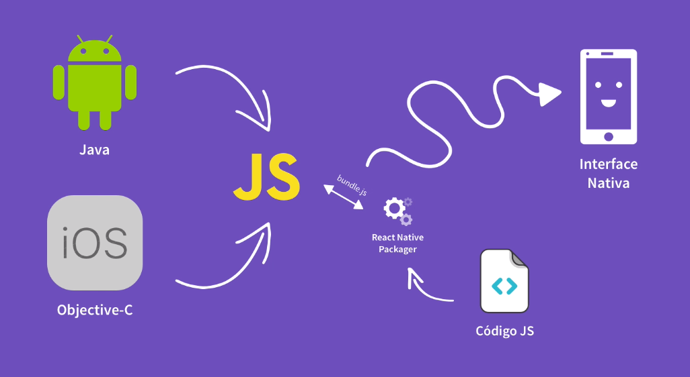
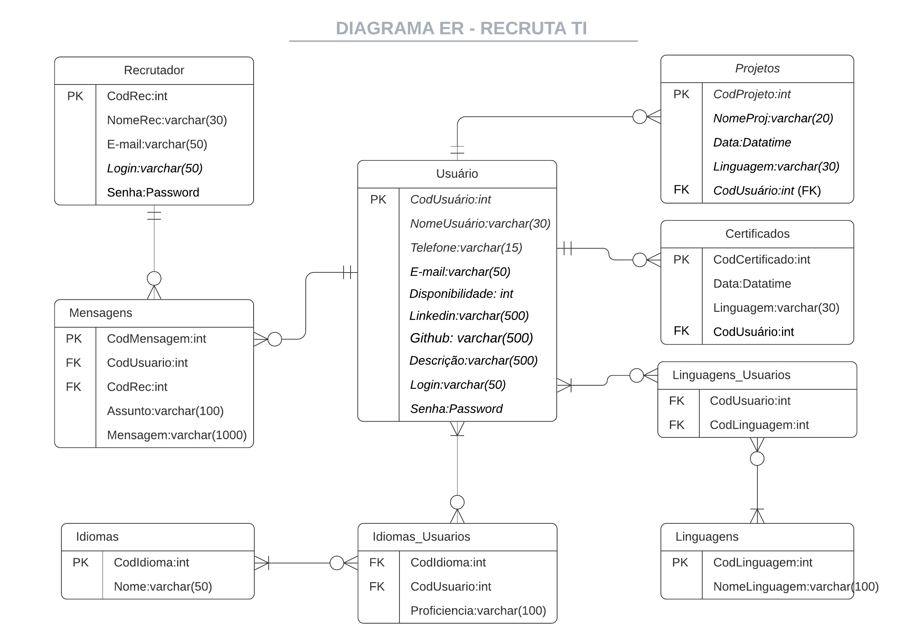
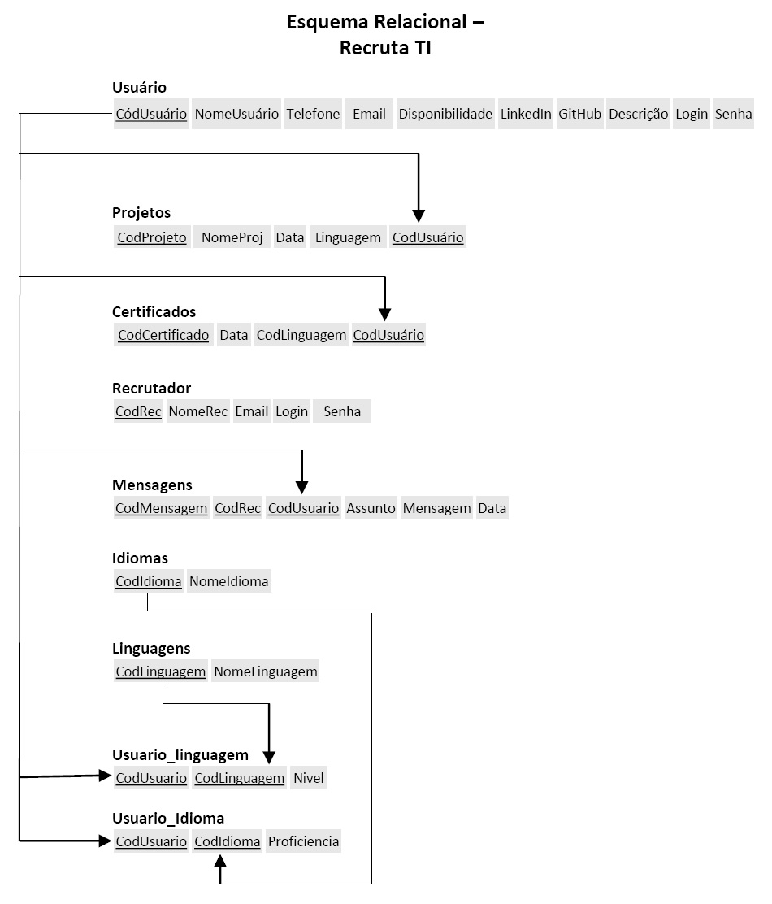
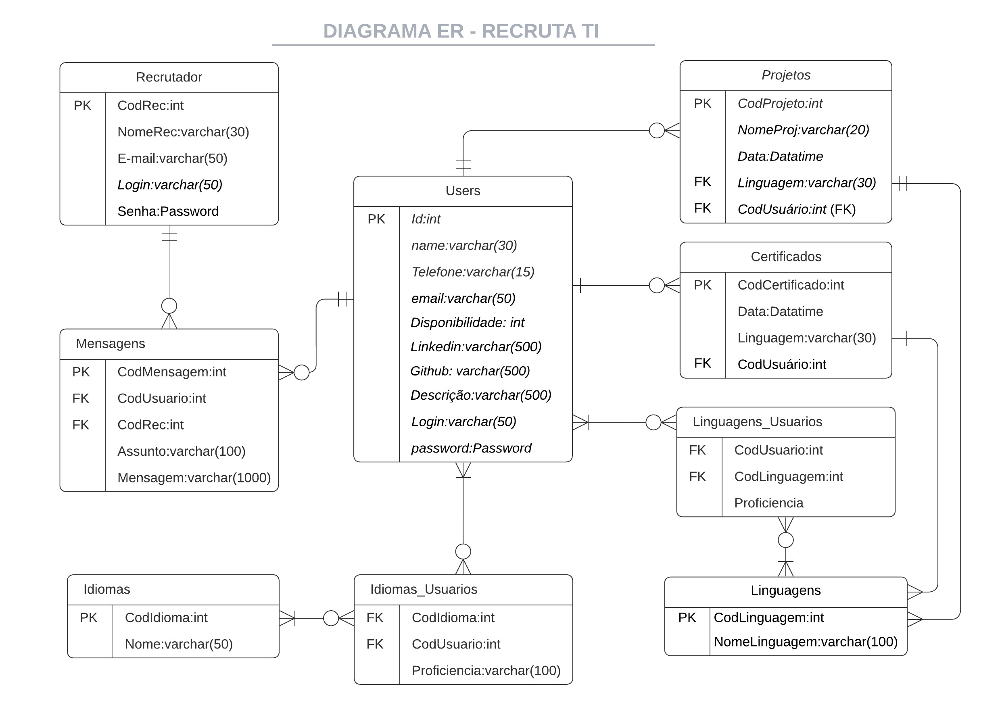
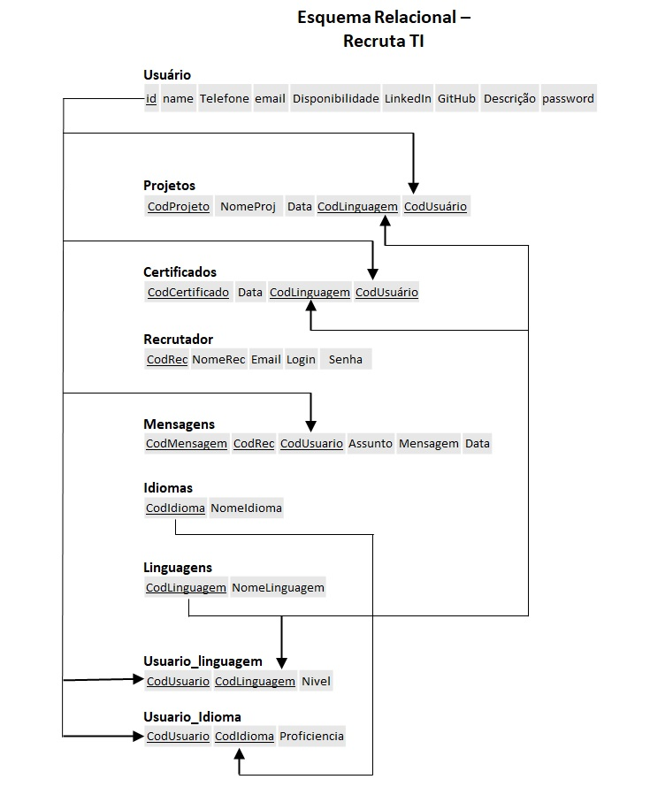

# Arquitetura da Solução

Pré-requisitos: <a href="3-Projeto de Interface.md"> Projeto de Interface</a>

A aplicação mobile está estrutura cliente/servidor na forma de camadas. Considerando as definições estruturais da documentação pela qual está determinado todo o desenvolvimento da aplicação em questão.
A funcionalidade do código do aplicativo não é necessariamente uniforme em todo o aplicativo. Certas seções do código do aplicativo são mais adequadas para lidar com a interface do usuário, enquanto outras seções são desenvolvidas para gerenciar a lógica de negócios ou se comunicar com o banco de dados ou sistemas back-end.

## Modelo ER

O Modelo ER representa através de um diagrama como as entidades (coisas, objetos) se relacionam entre si na aplicação interativa.

## Esquema Relacional

O Esquema Relacional corresponde à representação dos dados em tabelas juntamente com as restrições de integridade e chave primária.
 

Após o início do desenvolvimento da aplicação foi detectada a necessidade de alterações nas tabelas do banco de dados, como os campos de Linguagem das tabelas Certificados e Projetos, que serão uma chave estrangeira referenciando a tabela Linguagens.

O Diagrama ER e o Modelo Relacional alterados pode ser vistos abaixo:

## Modelo Físico

O arquivo [banco.sql](/src/bd/banco.sql) poderá ser encontrado na pasta src\bd.

## Tecnologias Utilizadas

A aplicação será desenvolvida utilizando a linguagem React Native. A IDE escolhida foi a EXPO, pelas seguintes razões:
> - Online
> - Gratuita
> - Possui ferramenta de pre-visualização, tanto para navegadores quanto para Android e iOS
> - Possui aplicativo (também gratuito) que permite abrir a aplicação sendo desenvolvida em qualquer aparelho

Para o backend e o banco de dados, será utilizada uma Fake API com JSON Server, hospedados no Heroku para permitir que todos os desenvolvedores da equipe manipulem os mesmos dados e permitir testes em diversos aparelhos.

## Hospedagem

A aplicação será hospedada na plataforma Expo, podendo ser acessada por qualquer pessoa com o link [https://snack.expo.dev/@rodrigolobenwein/recruta-ti](https://snack.expo.dev/@rodrigolobenwein/recruta-ti)

O backend e o banco de dados (JSON Server) estão hospedados no Heroku: [https://fake-api-json-server-recrutati.herokuapp.com/](https://fake-api-json-server-recrutati.herokuapp.com/)

## Qualidade de Software

Conceituar qualidade de fato é uma tarefa complexa, mas ela pode ser vista como um método gerencial que através de procedimentos disseminados por toda a organização, busca garantir um produto final que satisfaça às expectativas dos stakeholders.

No contexto de desenvolvimento de software, qualidade pode ser entendida como um conjunto de características a serem satisfeitas, de modo que o produto de software atenda às necessidades de seus usuários. Entretanto, tal nível de satisfação nem sempre é alcançado de forma espontânea, devendo ser continuamente construído. Assim, a qualidade do produto depende fortemente do seu respectivo processo de desenvolvimento.

A norma internacional ISO/IEC 25010, que é uma atualização da ISO/IEC 9126, define oito características e 30 subcaracterísticas de qualidade para produtos de software.
Com base nessas características e nas respectivas sub-características, identifique as sub-características que sua equipe utilizará como base para nortear o desenvolvimento do projeto de software considerando-se alguns aspectos simples de qualidade. Justifique as subcaracterísticas escolhidas pelo time e elenque as métricas que permitirão a equipe avaliar os objetos de interesse.

> **Links Úteis**:
>
> - [ISO/IEC 25010:2011 - Systems and software engineering — Systems and software Quality Requirements and Evaluation (SQuaRE) — System and software quality models](https://www.iso.org/standard/35733.html/)
> - [Análise sobre a ISO 9126 – NBR 13596](https://www.tiespecialistas.com.br/analise-sobre-iso-9126-nbr-13596/)
> - [Qualidade de Software - Engenharia de Software 29](https://www.devmedia.com.br/qualidade-de-software-engenharia-de-software-29/18209/)
