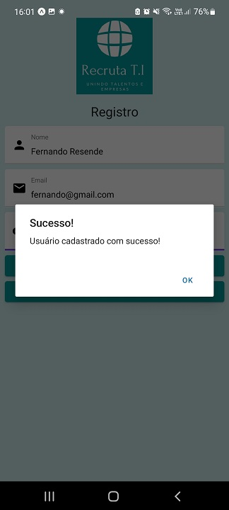

# Registro de Testes de Software

Pré-requisitos: <a href="3-Projeto de Interface.md"> Projeto de Interface</a>, <a href="8-Plano de Testes de Software.md"> Plano de Testes de Software</a>

|Caso de teste | TC-001  |
|------|------------|
|Item de Teste | Login Padrão |
|Requisito | RF-001 |
|Especificações de entrada | Email: rodrigo.lobenwein@sga.pucminas.br Senha: 123456
|Procedimento | Inserir o Email na área "Email", Inserir a senha na área "Senha", Clicar em "Login" |
|Resultado Esperado | Visualização da Tela "Perfil do Profissional" |
|Resultado obtido | OK |
|Evidência |   |

|Caso de teste | TC-002  |
|------|------------|
|Item de Teste | Login recusado 
|Requisito | RF-001 |
|Especificações de entrada | Email: rodrigo@sga.pucminas.br Senha: 123456
|Procedimento | Inserir o Email na área "Email", Inserir a senha na área "Senha", Clicar em "Login" |
|Resultado Esperado | Visualização da mensagem de alerta "Usuário/senha inválidos " |
|Resultado obtido | OK |
|Evidência |   |

|Caso de teste | TC-003  |
|------|------------|
|Item de Teste | Login recusado 
|Requisito | RF-001 |
|Especificações de entrada | Email: rodrigo.lobenwein@sga.pucminas.br Senha: 654321
|Procedimento | Inserir o Email na área "Email", Inserir a senha na área "Senha", Clicar em "Login" |
|Resultado Esperado | Visualização da mensagem de alerta "Usuário/senha inválidos " |
|Resultado obtido | OK |
|Evidência |   |

|Caso de teste | TC-004  |
|------|------------|
|Item de Teste | Registro padrão 
|Requisito | RF-001 |
|Especificações de entrada | Nome: Fernando Resende Email: fernando@gmail.com Senha: 123456
|Procedimento | Inserir os dados de entrada nas área correspondentes, clicar em "Registrar" |
|Resultado Esperado | Visualização da mensagem de alerta "Usuário cadastrado com sucesso!" |
|Resultado obtido | OK |
|Evidência |   |

|Caso de teste | TC-005  |
|------|------------|
|Item de Teste | Registro com email repetido 
|Requisito | RF-001 |
|Especificações de entrada | Nome: Fernando Resende Email: fernando@gmail.com Senha: 123456
|Procedimento | Inserir os dados de entrada nas área correspondentes, clicar em "Registrar" |
|Resultado Esperado | Visualização da mensagem de alerta "Usuário não foi cadastrado! Tente novamente mais tarde" |
|Resultado obtido | OK |
|Evidência |   |

|Caso de teste | TC-006 |
|------|------------|
|Item de Teste | Avaliação do tempo de resposta 
|Requisito | RNF-004 |
|Procedimento | Avaliar o tempo de resposta do servidor nos casos de teste TC-001 a TC-005 |
|Resultado Esperado | Tempo de resposta inferior a 5 segundos |
|Resultado obtido | OK |
|Evidência |  |

|Caso de teste | TC-007 |
|------|------------|
|Item de Teste | Campo de senha não deve mostrar a senha digitada 
|Requisito | RNF-002 |
|Procedimento | Verificar se os caracteres do campo senha estão ocultos  |
|Resultado Esperado | A senha não é exibida |
|Resultado obtido | OK |
|Evidência |  |

|Caso de teste | TC-008 |
|------|------------|
|Item de Teste | Criptografia da senha 
|Requisito | RNF-002 |
|Procedimento | Verificar se senha armazenada no banco de dados está criptografada  |
|Resultado Esperado | As senhas armazenadas estão criptografadas |
|Resultado obtido | OK |
|Evidência |  |

## Avaliação

Discorra sobre os resultados do teste. Ressaltando pontos fortes e fracos identificados na solução. Comente como o grupo pretende atacar esses pontos nas próximas iterações. Apresente as falhas detectadas e as melhorias geradas a partir dos resultados obtidos nos testes.

> **Links Úteis**:
> - [Ferramentas de Test para Java Script](https://geekflare.com/javascript-unit-testing/)